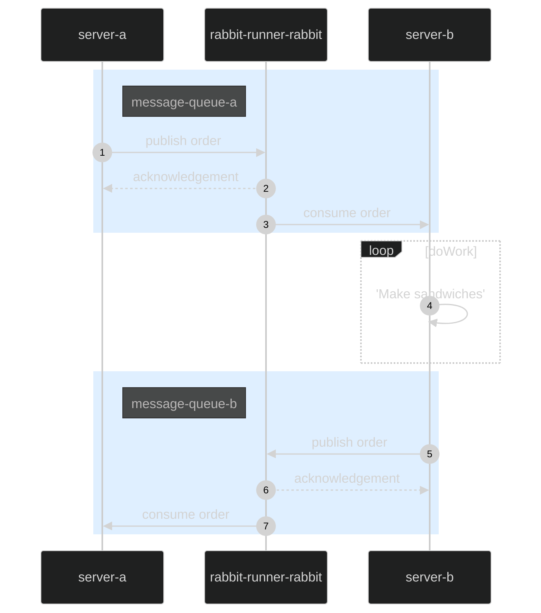

# Web dev course project: Sandwich shop

## Introduction

**See the project documentation pdf for more information (under /docs file)!**

WebDev2 -course project work. Collaborators:
- Esa Särkelä
- Heidi Seppi
- Mohammed Al-Gburi

## Running the application
Clone the repository to your local machine

Navigate to the root directory of the project

Build Docker images and start the containers
```
docker-compose up  
```
You can verify that the containers are running by using
```
docker-compose ps
```
Stop container
```
docker-compose down
```
Data saved to MongoDB is mounted to a local directory and persists between restarts.
## Accessing the application
Once the application is running, you can access it as follows:

**Server-a**: http://localhost:8080. The backend API used to place sandwich orders. Documentation available at the http://localhost:8080/docs endpoint

**Server-b**: Does not expose any ports to the host machine.

**Frontend**: http://localhost:80. React application hosted on nginx.

**RabbitMQ**: Does not expose any ports to the host machine.

**MongoDB**: Does not expose any ports to the host machine.

## Build with
### Frontend
- React: frontend framework
### Backend
- Node.js: backend runtime
- Mongoose: ORM
- RabbitMQ: AMPQ message broker
- Express: REST API framework
### Database
- MongoDB
### Containerization
- Docker

## Order status updates

There are `5` possible states for the order. Initially it is set to as `ordered` and added to `message-queue-A`. On succesful `ack` it is changed to `inQueue` and `failed` otherwise. When `server-b` begins processing the order, order status is set to `received` and added to `message-queue-B`. When processing is done, the status is set to `ready` and added to `message-queue-B`.

Considerations:
* If `server-A` fails to receive messages from `message-queue-B`, order status will not be updated correctly

## Sequence diagram of backend


